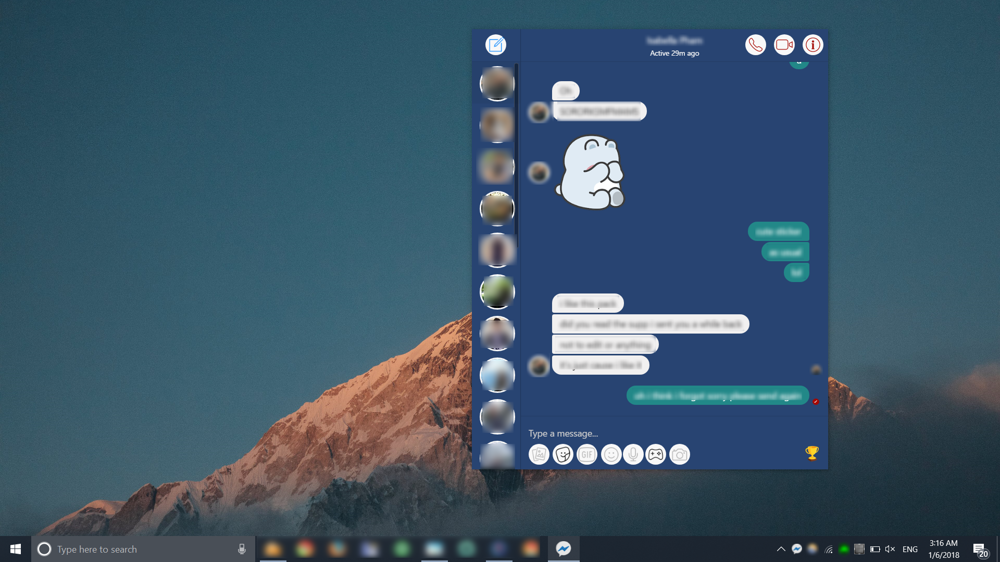
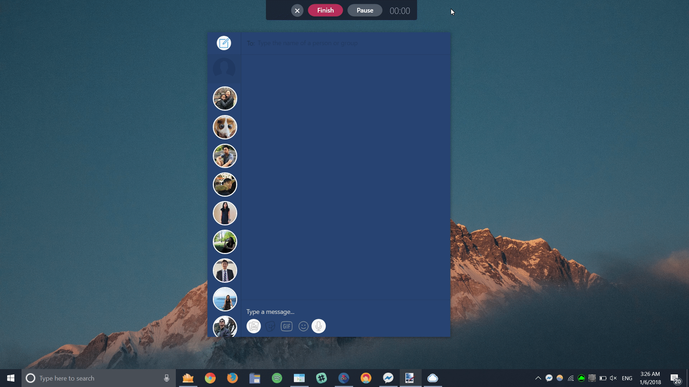
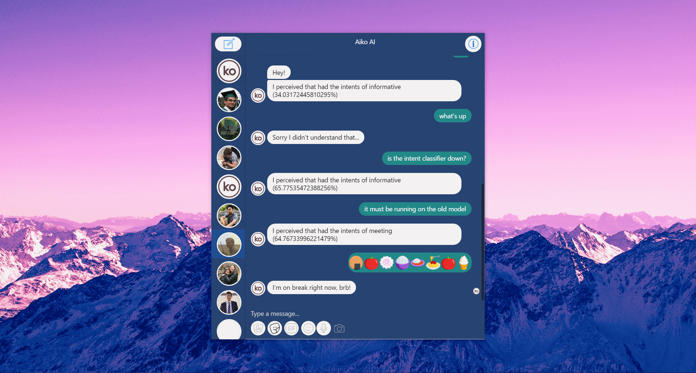
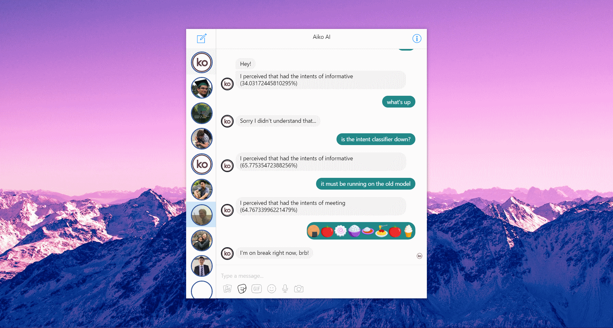
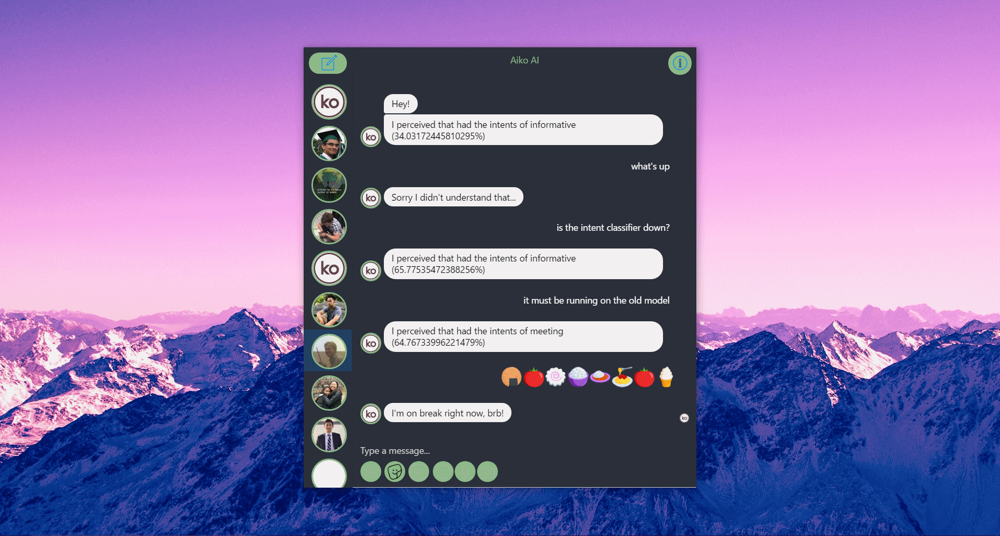
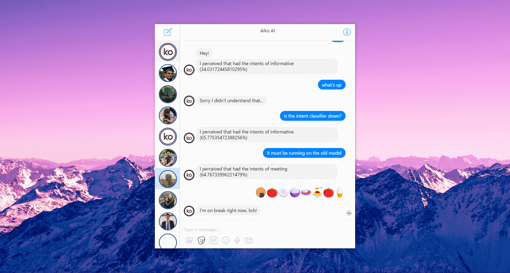
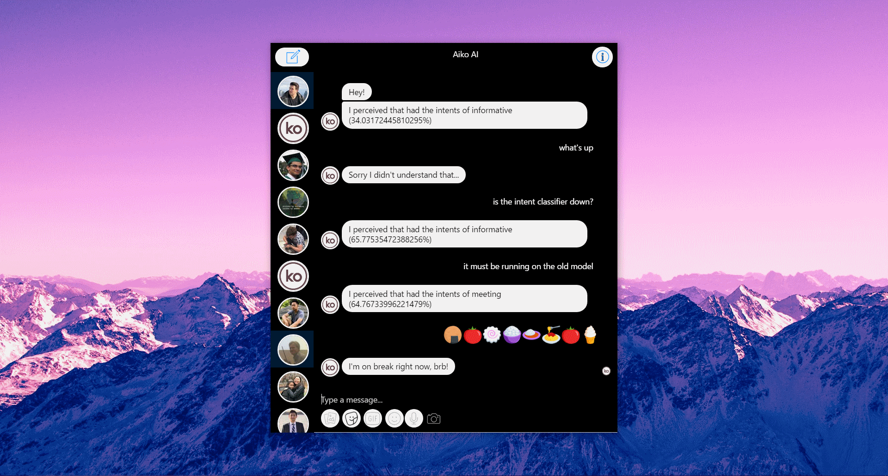
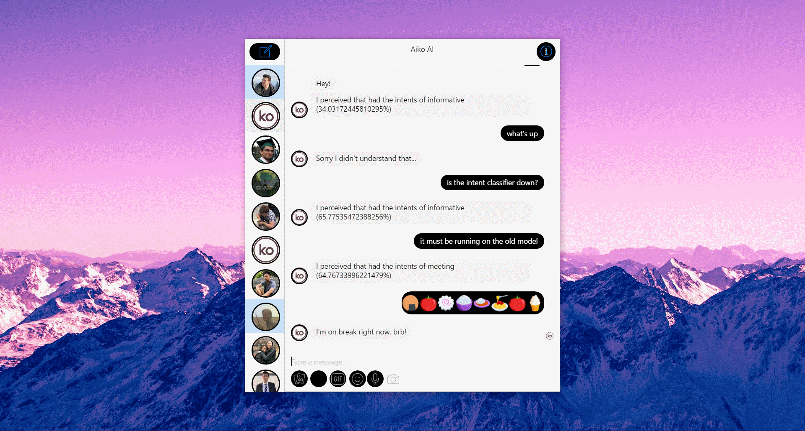

# Custom Messenger

A fully featured Facebook Messenger desktop app, beautifully and minimally made with Electron.

    

    

    
    
    

    
    
    

# Getting Started

Executables coming soon. If you're electron-friendly, please feel free to build and upload executables to this repo!

## Bindings/Shortcuts

You can drag the window from the top bar (the title of the conversation).

All keybindings start with <kbd>Ctrl</kbd>.

<kbd>Ctrl</kbd> <kbd>Q</kbd> will **close the window, but not the app.**

<kbd>Ctrl</kbd> <kbd>R</kbd> will **refresh the browser.**

Right-clicking the tray icon **opens the menu**.

Clicking the tray icon **launches the app**.

<kbd>Ctrl</kbd> <kbd>Backspace</kbd> goes back one page in history, aka to **previous conversation**.

<kbd>Ctrl</kbd> <kbd>M</kbd> **minimizes** the window.

<kbd>Ctrl</kbd> <kbd>Shift</kbd> <kbd>F</kbd> sets the app to fullscreen.

<kbd>Ctrl</kbd> <kbd>Y</kbd> **centers** the app.

<kbd>Ctrl</kbd> <kbd>Tab</kbd> **toggles the conversation list**.

<kbd>Ctrl</kbd> <kbd>Shift</kbd> <kbd>I</kbd> toggles Developer Tools.

## Theming

There are 4 provided themes ('Light', 'Dark', 'Venom', and 'Custom').

You can select a theme by right-clicking the tray and selecting a Theme. You may set this theme as the default by clicking Customize in the tray menu, and changing the "defaultTheme" property to whatever you wish.

To make your own theme, you can edit the values by clicking Customize in the tray menu. This will change the "Custom" theme, and you can see your changes by selecting the "Custom" theme from the tray menu.

If you have made edits to the current window or current theme, you can select "Full Reload" to reload with your changes.

# I want to Develop

## Requirements

- Electron (`npm install electron --save-dev --save-exact --global`, global so we can use the `electron` CLI)
- Electron Local Shortcut and some other plugins (`npm i` in this repo will do it)

## Electron Install not working?

Try `npm i` and then install electron

## I have Electron, Quick Start?

`electron .`

## Logging and Deploying

Set the debug var in main.js (first line) to false before deploying, leave as true for logs in console.

## How do I package this?

You need electron-packager. To install look at `https://github.com/electron-userland/electron-packager` 

`electron-packager . <name>`

We've been using Fapkin as the name to keep things organized.

Go to the folder named Fapkin and paste here the messenger.ico, then run FapkinChat.exe

# Credits

Icons made by <a href="http://www.freepik.com" title="Freepik">Freepik</a> from <a href="https://www.flaticon.com/" title="Flaticon">www.flaticon.com</a> is licensed by <a href="http://creativecommons.org/licenses/by/3.0/" title="Creative Commons BY 3.0" target="_blank">CC 3.0 BY</a>
